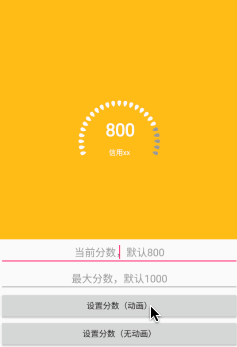
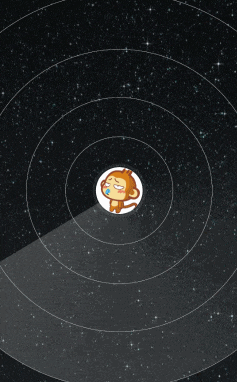
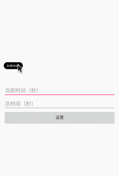

## 介绍

自己模仿一些App的自定义view，全部用kotlin写，持续更新中...欢迎star。
也许你还喜欢这些自定义控件：
- [RobotLoading](https://github.com/vicedev/RobotLoading)

|    App     |       效果       |                           演示                            |
| :--------: | :--------------: | :-------------------------------------------------------: |
|    get     | 发布内容弹出效果 |         |
| 马蜂窝旅游 |     蠕动tab      |     |
|   支付宝   |    芝麻信用分    |           |
|    微信    |    雷达加朋友    |  |
|  虾米音乐  |    音乐进度条    |    |
